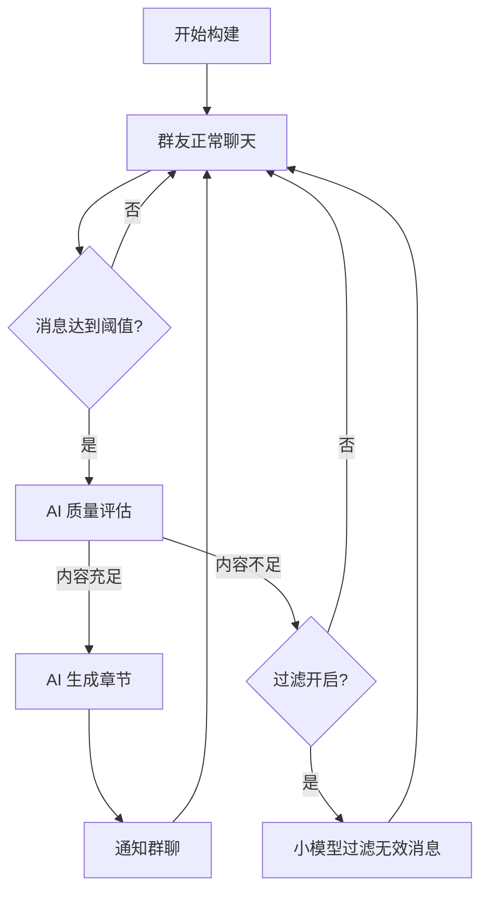

# 📖 群体协作长篇小说 AstrBot 插件 v3.0

> ⚠️ **免责声明**：本插件代码主要由 AI 生成，可能存在未知的 bug 或逻辑问题。请在生产环境中使用时保持谨慎，建议先在测试群进行充分测试。

QQ群群友协作 + AI辅助写作的长篇小说插件。群友提供创意和设定，AI 负责评审、生成和润色。还可自动收集群聊消息生成小说！

**插件交流群:** 1077289182

## ✨ 核心功能

| 功能模块 | 说明 |
|---------|------|
| 🌍 知识库 | JSON 存储世界观、人物、多风格模板，AI 自动整理完善世界观 |
| 💡 创意系统 | 群友提交创意 → 多AI打分(×3轮) → 冲突检测 → 投票决策 |
| ✍️ 场景写作 | 以"场景"为最小单元，基于知识库+风格参考生成（默认4000+字），自动维护摘要 |
| ✏️ 多AI修正 | 三轮流水线：审读→修改→审校，逐步提升文本质量 |
| 🧑 人物管理 | 添加/修改/删除角色，同名重复自动拦截，AI 写作时自动提取新角色 |
| 🔧 用户介入修正 | 用户可描述修改意见或进入交互收集模式，AI 根据反馈修正章节 |
| 📊 投票系统 | 冲突自动发起投票，群友参与投票决定方案 |
| 🔒 群隔离 | 每个群独立一部小说，数据互不干扰 |
| 🤖 分角色AI模型 | WebUI 下拉选择，可为创意评分/写作/修正/世界观分别指定AI模型 |
| 👥 贡献者追踪 | 自动记录参与创作的群友昵称，导出时显示在封面 |
| 📚 多格式导出 | 支持 TXT / EPUB / PDF，导出后自动发送文件到群聊 |
| 🗣️ **群聊小说** | **新！**自动收集群聊消息，AI 以群友为原型生成小说，每群独立 |

### v3.0 新增特性

- **🎯 质量阈值可配置**：`chat_novel_quality_threshold` 设置有效消息占比阈值（0-100，默认 40），低于此值判定内容不足
- **🔍 小模型过滤无用消息**：`chat_novel_filter_enabled` 开启后，内容不足时自动用小模型过滤无效消息，仅保留有效消息继续收集
- **📝 自定义设定**：`/群聊小说 设定 <内容>` 中途添加设定，导出时显示在简介中
- **🎬 强制结局**：`/群聊小说 结局` 下一次生成时强制收束故事并自动停止收集
- **⚡ 立即生成**：`/群聊小说 立即生成` 跳过阈值检查，直接用已积累的消息生成章节
- **✏️ 章节重写**：`/群聊小说 重写 <章节号> <说明>` 用补充说明重新生成指定章节
- **🔗 关系图**：`/群聊小说 关系图` AI 分析角色关系，通过 mermaid.ink 渲染为图片发送
- **👤 角色编辑**：`/群聊小说 修改角色 <名字> <描述>` 手动设定角色
- **🔒 角色锁定**：`/群聊小说 锁定角色 <名字>` 防止 AI 自动修改角色设定
- **📖 TXT 导出增强**：导出 TXT 时自动包含出场人物和简介

### v2.5 特性

- 群聊小说预览控制：`chat_novel_preview_limit` + `/群聊小说 关闭预览` `/群聊小说 开启预览`

### v2.4 特性

- **🗣️ 群聊小说增强**：
  - 新增指令：`/群聊小说 修改名称 <新书名>`、`/群聊小说 删除`
  - 优化构建指令：`/群聊小说 开始构建 <书名> <要求>`
  - 导出优化：PDF/EPUB 简介页将风格要求与剧情分开展示，修复作者名过长换行问题
  - 配置项：`chat_novel_threshold` 可自定义触发章节生成的阈值

### v2.3 特性

- **🗣️ 群聊小说**：全新功能，自动收集群聊消息并生成小说
  - 发送 `/群聊小说 开始构建 <书名> <要求>` 开始收集
  - AI 以群友为人物原型，根据聊天内容自动创作小说章节
  - 每累计 50 条消息自动生成一章（可配置）
  - 完整的人物管理、阅读、导出支持
  - 与现有 `/小说` 功能完全独立

### v2.2 特性

- **✏️ 修改人物命令**：`/小说 修改人物 <名字> <新描述>` 随时修改角色设定
- **🚫 人物防重复**：添加角色时自动检测同名角色，已存在则提示使用修改命令
- **📝 AI 长篇写作**：场景默认字数提升至 4000 字，prompt 增强要求丰富的环境描写、心理活动和感官细节
- **🤖 AI 自动收录人物**：AI 写作时自动识别新角色并添加到人物库（含详细描述和背景），同名角色自动合并不重复
- **🔧 描述录入修复**：修复了添加人物时描述文本被框架截断未能保存的问题

### v2.1 特性

- **🤖 分角色AI模型配置**：在 WebUI 中通过下拉框为创意评分、写作生成、修正审校、世界观整理分别配置不同的AI模型
- **👥 贡献者追踪**：自动记录参与创作群友的QQ昵称，PDF/EPUB 封面显示 "作者: xxx, xxx"
- **🔧 用户介入修正**：`/小说 更改 <章节号> <描述>` 一次性提交修改意见，或 `/小说 更改 <章节号> 开始` 进入交互收集模式
- **🗑️ 删除指令**：`/小说 删除人物`、`/小说 删除设定`、`/小说 清空世界观`
- **📤 文件自动发送**：导出 TXT/EPUB/PDF 后自动将文件发送到群聊
- **📄 MikTeX PDF**：PDF 导出优先使用 xelatex 获得更好的排版质量，不可用时自动回退到 fpdf2

---

## 📦 安装

### 1. 复制插件

将整个文件夹放到 AstrBot 插件目录：
```
AstrBot/data/plugins/astrbot_plugin_novel/
```

### 2. 安装依赖

```bash
pip install ebooklib fpdf2
```

> `ebooklib` 用于 EPUB 导出，`fpdf2` 用于 PDF 导出（当 xelatex 不可用时）。如果不需要这两种格式，可以不安装（TXT 导出不需要额外依赖）。

### 3. 启用插件

在 AstrBot WebUI 中启用 **群体协作长篇小说** 插件，然后重载。

---

## ⚙️ 配置项

在 WebUI 的插件配置页面调整：

### 基础配置

| 配置项 | 类型 | 默认值 | 说明 |
|--------|------|--------|------|
| `enabled_groups` | list | `[]` | **允许使用本插件的群号列表**。留空=所有群都可用 |
| `score_threshold` | int | 70 | 创意通过的最低加权平均分（0-100） |
| `ai_score_rounds` | int | 3 | AI 打分轮数（模拟多AI评审） |
| `vote_duration_minutes` | int | 30 | 冲突投票持续时间（分钟） |
| `max_scene_length` | int | 4000 | 单个场景的最小生成字数（AI 会尽量写更多） |
| `debug` | bool | false | 开启调试日志 |
| `allow_private_commands` | bool | false | 允许在私聊中使用指令 |
| `chat_novel_threshold` | int | 50 | 群聊小说：每累计多少条消息自动生成一章 |
| `chat_novel_max_word_count` | int | 2000 | 群聊小说：每章最大字数 |
| `chat_novel_preview_limit` | int | 800 | 群聊小说：预览文本字数上限（0 = 不限制） |
| `chat_novel_eval_timeout` | int | 30 | 群聊小说：质量评估超时（秒） |
| `chat_novel_quality_threshold` | int | 40 | 群聊小说：有效消息占比阈值（0-100） |
| `chat_novel_filter_enabled` | bool | false | 群聊小说：内容不足时是否启用小模型过滤 |
| `chat_novel_filter_provider` | string | `""` | 群聊小说：过滤用小模型（留空用默认模型） |

### AI 模型配置

每个功能角色可在 WebUI 中通过**下拉框**选择已配好的模型商。留空则使用全局默认模型。

| 配置项 | 说明 | 对应功能 |
|--------|------|----------|
| `provider_idea_scoring` | 创意评分 AI | 创意提交打分 |
| `provider_writing` | 写作生成 AI | 场景写作 |
| `provider_revision` | 修正审校 AI | 场景/章节修正 |
| `provider_worldview` | 世界观整理 AI | 世界观自动/手动整理 |
| `provider_cover_image` | 封面绘图 AI | 封面图片生成 |

> 💡 建议：写作和修正使用较强的模型（如 GPT-4 / Claude），创意评分和世界观整理可使用性价比更高的模型。

### 封面图片配置

导出 EPUB/PDF 时可用 AI 生成封面图片，需先开启并配置绘图模型：

| 配置项 | 类型 | 默认值 | 说明 |
|--------|------|--------|------|
| `enable_cover_image` | bool | false | 导出 EPUB/PDF 时是否用 AI 生成封面图片 |
| `cover_image_model` | string | `""` | 绘图模型名称（如 `seedream-3.0`、`dall-e-3`，留空由 API 自动选择） |
| `cover_image_size` | string | `""` | 封面图片尺寸（如 `1024x1536`，留空使用默认） |
| `cover_image_prompt` | string | *预置提示词* | 封面绘图自定义提示词（会与剧情简介合并） |
| `cover_reference_image` | string | `""` | 参考图片路径（留空则纯文生图，填写后模仿参考图风格） |
| `cover_image_timeout` | int | 180 | 封面图片生成超时时间（秒） |

### 群白名单配置示例

只允许群号 `123456789` 和 `987654321` 使用：
```json
{
  "enabled_groups": ["123456789", "987654321"]
}
```

留空则所有群都可使用：
```json
{
  "enabled_groups": []
}
```

---

## 📁 数据结构

```text
AstrBot/data/plugin_data/astrbot_plugin_novel/
└── groups/
    ├── 123456789/                    ← 群 123456789 的数据
    │   ├── knowledge/
    │   │   ├── worldview.json
    │   │   ├── worldview_backup.json ← AI 整理前的备份
    │   │   ├── characters.json
    │   │   └── styles/
    │   │       └── 硬科幻.json
    │   ├── novel.json               ← 含 contributors 贡献者列表
    │   ├── ideas.json
    │   ├── votes.json
    │   └── exports/                  ← 导出文件
    │       ├── 星辰之海.txt
    │       ├── 星辰之海.epub
    │       └── 星辰之海.pdf
    │   ├── chat_novel.json          ← 群聊小说数据（状态、章节、人物）
    │   └── chat_messages.json       ← 群聊消息缓冲区
    └── 987654321/                    ← 群 987654321 的数据（完全独立）
        ├── knowledge/ ...
        └── novel.json ...
```

---

## 🎮 指令一览

所有指令以 `/小说` 开头（也可用 `/novel`）。

> 💡 v2.2 新增：`/小说 修改人物`、人物防重复、AI 自动收录人物。

### 基础指令

| 指令 | 说明 |
|------|------|
| `/小说 帮助` | 显示所有可用指令 |
| `/小说 初始化 <标题>` | 创建一部新小说 |
| `/小说 状态` | 查看当前小说的进度、字数、概要 |
| `/小说 重置` | ⚠️ 清空当前群的所有数据，重新开始 |

### 知识库指令

| 指令 | 说明 |
|------|------|
| `/小说 世界观` | 查看当前世界观 |
| `/小说 设定 <内容>` | 添加/修改世界观 |
| `/小说 整理世界观` | 手动触发 AI 整理完善世界观 |
| `/小说 删除设定 <字段> <关键词>` | 删除世界观中的某条设定 |
| `/小说 清空世界观` | 清空整个世界观 |
| `/小说 添加人物 <名字> <描述>` | 添加一个新角色（同名自动拦截） |
| `/小说 修改人物 <名字> <内容>` | **✨新** 修改角色设定 |
| `/小说 删除人物 <名字>` | 删除角色 |
| `/小说 人物列表` | 查看所有角色 |
| `/小说 人物 <名字>` | 查看某个角色的详情 |

### 风格指令

| 指令 | 说明 |
|------|------|
| `/小说 风格列表` | 查看所有可用风格 |
| `/小说 添加风格 <名称>` | 创建新风格，之后发送示例文本自动收集 |
| `/小说 风格样本 <名称> <文本>` | 手动为某风格追加一段示例文本 |
| `/小说 切换风格 <名称>` | 切换当前写作使用的风格 |
| `/小说 完成风格` | 结束风格样本收集 |

### 创意指令

| 指令 | 说明 |
|------|------|
| `/小说 创意 <内容>` | 提交一个创意（自动打分+冲突检测） |
| `/小说 创意列表` | 查看所有已采纳的创意 |

### 写作指令

| 指令 | 说明 |
|------|------|
| `/小说 新章节 <标题>` | 创建新章节 |
| `/小说 写 <场景描述>` | AI 根据描述生成一个新场景 |
| `/小说 修正` | 对最新场景进行三轮 AI 修正润色 |
| `/小说 大纲` | 查看当前小说的章节和场景大纲 |
| `/小说 更改 <章节号> <描述>` | 一次性提交修改意见，AI 修正指定章节 |
| `/小说 更改 <章节号> 开始` | 进入交互修正模式，逐条收集修改意见 |
| `/小说 结束更改` | 结束交互修正，将收集的意见提交 AI 修改 |

### 投票指令

| 指令 | 说明 |
|------|------|
| `/小说 投票` | 查看当前进行中的投票 |
| `/小说 投票 <选项>` | 投票（A/B/C） |
| `/小说 结束投票` | 手动关闭当前投票 |

### 导出指令

| 指令 | 说明 |
|------|------|
| `/小说 导出` | 导出全文为 TXT 并发送到群聊 |
| `/小说 导出 epub` | 导出为 EPUB 电子书并发送到群聊 |
| `/小说 导出 pdf` | 导出为 PDF 并发送到群聊 |
| `/小说 阅读 [章节号]` | 阅读指定章节（不填读最新） |

---

### 🗣️ 群聊小说指令

与 `/小说` 完全独立的功能，基于群聊消息自动生成小说。所有指令以 `/群聊小说` 开头。

#### 基础控制

| 指令 | 说明 |
|------|------|
| `/群聊小说 帮助` | 显示群聊小说指令 |
| `/群聊小说 开始构建 <书名> <要求>` | 开始收集群聊消息并构建小说 |
| `/群聊小说 停止` | 停止收集 |
| `/群聊小说 继续` | 继续收集（从停止状态恢复） |
| `/群聊小说 状态` | 查看进度 |
| `/群聊小说 修改名称 <新书名>` | 修改小说名称 |
| `/群聊小说 删除` | 删除本群所有小说数据 |

#### 创作控制（v3.0 新增）

| 指令 | 说明 |
|------|------|
| `/群聊小说 设定 <内容>` | 添加自定义设定（显示在导出简介中） |
| `/群聊小说 结局` | 标记下次生成为强制结局，生成后自动停止收集 |
| `/群聊小说 立即生成` | 跳过消息阈值检查，立即用已有消息生成章节 |
| `/群聊小说 重写 <章节号> [说明]` | 用补充说明重新生成指定章节 |

#### 角色管理

| 指令 | 说明 |
|------|------|
| `/群聊小说 人物列表` | 查看所有角色（群友 → 小说角色） |
| `/群聊小说 人物 <名字>` | 查看角色详情 |
| `/群聊小说 修改角色 <名字> <新描述>` | 手动修改角色设定 |
| `/群聊小说 锁定角色 <名字>` | 锁定角色设定（AI 不会自动修改，再次执行解锁） |

#### 数据分析（v3.0 新增）

| 指令 | 说明 |
|------|------|
| `/群聊小说 关系图` | AI 分析角色关系并生成关系图图片 |

#### 阅读与导出

| 指令 | 说明 |
|------|------|
| `/群聊小说 阅读 [章节号]` | 阅读指定章节（不填读最新） |
| `/群聊小说 导出 pdf/epub/txt` | 导出小说文件 |
| `/群聊小说 封面生成 停止/开始` | 控制导出时是否自动生成封面 |
| `/群聊小说 关闭预览` / `开启预览` | 控制章节生成后是否发送预览文本 |

---

## 📚 详细使用教程

### 第一步：初始化小说

```
/小说 初始化 星辰之海
```
> ✅ 小说《星辰之海》已创建！

---

### 第二步：构建世界观

多次添加世界观设定：
```
/小说 设定 名称：星辰联邦
/小说 设定 描述：公元3000年，人类已殖民三个星系。跃迁引擎基于暗物质共振原理。
/小说 设定 规则：超光速航行需要跃迁引擎
```

> ✅ 每添加 5 次设定/人物/创意，AI 会**自动在后台整理世界观**，将散乱信息归类为结构化文档。

手动触发整理：
```
/小说 整理世界观
```
> 🔄 正在使用 AI 整理世界观...
> ✅ 世界观整理完成！
> 💾 旧版世界观已备份到 worldview_backup.json

删除某条不需要的设定：
```
/小说 删除设定 rules 魔法禁令
```

---

### 第三步：添加角色

```
/小说 添加人物 林远 25岁的星舰导航员，沉稳冷静，在压力下反而更加专注
/小说 添加人物 苏黎 联邦暗物质研究所首席科学家，28岁天才少女
```

> ⚠️ 同名角色会被自动拦截，提示使用修改命令。

修改角色设定：
```
/小说 修改人物 林远 25岁星舰导航员，沉稳冷静，拥有感知暗物质的异能
```
> ✅ 角色「林远」的设定已更新！

删除不需要的角色：
```
/小说 删除人物 林远
```

> 💡 AI 在写作场景时，如果引入了新角色，会自动识别并添加到人物库（含详细描述和背景信息）。

---

### 第四步：设置写作风格

```
/小说 添加风格 硬科幻
```
然后直接在群里发送示例文本（自动收集）：
```
星舰的跃迁引擎发出低沉的嗡鸣，量子态的涟漪从引擎核心向外扩散...
```
完成收集后：
```
/小说 完成风格
/小说 切换风格 硬科幻
```

---

### 第五步：提交创意

```
/小说 创意 林远在跃迁事故后获得了感知暗物质流动的能力，但每次使用都会剧烈头痛
```
> 💡 收到创意，正在进行 AI 评分...
> ✅ 评分通过（均分 86.3），正在冲突检测...
> ✅ 创意已采纳！

---

### 第六步：开始写作

```
/小说 新章节 觉醒
/小说 写 林远在跃迁事故后苏醒，苏黎发现他脑部出现异常暗物质共振波形
```
> 📝 正在生成场景...
> 📖 场景生成完成！

---

### 第七步：修正润色

**AI 自动修正**（三轮流水线）：
```
/小说 修正
```
> ✏️ 三轮修正：审读 → 修改 → 审校
> ✅ 修正完成！（v2）

**用户介入修正**（一次性描述）：
```
/小说 更改 1 主角的性格需要更强势一些，对话要更果断
```

**用户介入修正**（交互收集模式）：
```
/小说 更改 1 开始
```
> 📝 已进入第 1 章交互修正模式。

然后逐条发送修改意见：
```
第一段的环境描写不够紧张
苏黎的台词太生硬了
结尾需要一个悬念
```

收集完毕后提交：
```
/小说 结束更改
```
> ✏️ 已收集 3 条修改意见。正在提交给 AI 修正...

---

### 第八步：导出

```
/小说 导出 epub
```
> 📚 正在生成 EPUB...
> ✅ EPUB 导出完成！（文件自动发送到群聊）

```
/小说 导出 pdf
```
> 📄 正在生成 PDF...
> ✅ PDF 导出完成！（文件自动发送到群聊）

> 💡 导出的 PDF/EPUB 封面会自动显示参与创作群友的昵称（格式：`作者: xxx, xxx`）

---

### 重新开始

```
/小说 重置
```
> ✅ 已清空所有小说数据（知识库、创意、章节、投票）。
> 现在可以使用 /小说 初始化 <标题> 开始新故事！

---

## 🔄 AI 自动整理世界观

插件会在以下操作后累计计数，**每 5 次关键操作**自动触发 AI 整理世界观：
- 添加世界观设定
- 添加角色
- 创意被采纳
- 场景生成完成

AI 整理会：
1. 将散乱设定按类别归类（物理法则、社会制度、地理环境、历史、势力等）
2. 补充合理的细节（不与已有设定矛盾）
3. 标注设定之间的潜在矛盾
4. 整理前自动备份到 `worldview_backup.json`

你也可以随时手动触发：`/小说 整理世界观`

---

## 👥 贡献者追踪

插件会在以下操作时自动记录群友的 QQ 昵称：
- 提交创意（`/小说 创意`）
- 场景写作（`/小说 写`）
- 添加世界观设定（`/小说 设定`）
- 添加角色（`/小说 添加人物`）
- 修正章节（`/小说 更改` / `/小说 结束更改`）

贡献者列表存储在 `novel.json` 的 `contributors` 字段中，去重保存。导出 PDF / EPUB 时，封面作者栏自动显示为 `作者: 张三, 李四, 王五`。如无贡献者，回退到 `群体协作`。

---

## 🤖 分角色AI模型配置

不同的 AI 功能可以配置不同的模型，通过 WebUI 下拉选择已配好的模型商：

| 角色 | 配置项 | 推荐模型 |
|------|--------|----------|
| 创意评分 | `provider_idea_scoring` | 性价比模型即可 |
| 写作生成 | `provider_writing` | 推荐强力模型 |
| 修正审校 | `provider_revision` | 推荐强力模型 |
| 世界观整理 | `provider_worldview` | 性价比模型即可 |

留空则使用全局默认模型。优先从配置读取，不可用时自动回退到默认。

---

## 🔒 群隔离说明

- 每个群的小说数据**完全独立**，存储在 `groups/<群号>/` 子目录下
- 群 A 的操作不会影响群 B
- 每个群可以同时进行不同的小说创作
- 通过 `enabled_groups` 配置项控制哪些群可以使用插件

---

## 💡 使用技巧

1. **世界观越详细越好**：多次使用 `/小说 设定` 逐步补充，AI 会自动整理
2. **风格样本 3-5 段**：每段 100-300 字，涵盖叙事、对话、心理描写
3. **场景描述要具体**：描述越详细，AI 生成质量越高
4. **每写完就修正**：`/小说 修正` 会保留历史版本不丢失
5. **善用用户介入修正**：AI 修正不满意时，用 `/小说 更改` 提出具体意见让 AI 重改
6. **定期导出备份**：`/小说 导出 epub` 生成精美电子书
7. **分配AI模型**：写作使用强力模型，评分和整理使用便宜模型，兼顾质量和成本
8. **善用修改人物**：随时用 `/小说 修改人物` 完善角色设定，AI 写作时参考最新设定
9. **留意自动收录**：AI 写作时会自动提取新角色到人物库，写完后查看 `/小说 人物列表` 确认
10. **试试群聊小说**：发送 `/群聊小说 开始构建 <风格>` 即可自动把聊天记录变成小说

---

## 🗣️ 群聊小说详细使用说明

群聊小说是一个**独立于 `/小说` 的全自动创作功能**——插件静默收集群聊消息，AI 以群友为人物原型创作小说。每个群完全独立，与 `/小说` 功能互不干扰，可在同一个群同时使用两套功能。

> 💡 **核心理念**：群友只需正常聊天，插件自动在后台将聊天内容转化为小说情节。无需刻意配合，AI 会自行提炼话题、构建角色、编织故事。

---

### 📋 一、快速上手（3 步开始）

#### 第 1 步：开启收集

在群里发送指令，指定**书名**和**风格/主题要求**：

```
/群聊小说 开始构建 仙途纪事 轻松日常风格，充满欢笑和友情
```
> ✅ 群聊小说《仙途纪事》开始构建！
> 📡 正在收集群聊消息...
> 🎯 风格要求：轻松日常风格，充满欢笑和友情
> 📊 每 50 条消息自动生成一章

**风格要求示例**：
- `传统武侠风格，快意恩仇`
- `赛博朋克科幻，暗黑风格`
- `校园青春日常，轻松搞笑`
- `悬疑推理，紧张刺激`

#### 第 2 步：正常聊天

群友们像平时一样聊天即可。插件会**被动收集**每条非命令消息（以 `/` 开头的消息不收集）。

- 聊天不受任何影响，插件只是静默记录
- 每累积到设定的阈值（默认 50 条），自动触发章节生成
- 生成完成后会在群里发送通知和预览

#### 第 3 步：阅读和导出

```
/群聊小说 阅读          ← 阅读最新章节
/群聊小说 阅读 2        ← 阅读第 2 章
/群聊小说 导出 pdf      ← 导出完整小说为 PDF
```

就这么简单！以下是进阶功能。

---

### 🔄 二、完整工作流程



**详细流程说明**：

1. **开始收集** — `/群聊小说 开始构建 <书名> <风格>` 激活被动收集模式
2. **消息积累** — 群友正常聊天，插件记录每条消息（发送者昵称 + 内容）
3. **阈值触发** — 消息数达到 `chat_novel_threshold`（默认 50 条）时触发
4. **质量评估** — AI 评估消息内容是否有足够的有效信息（由 `chat_novel_quality_threshold` 控制）
5. **章节生成** — 评估通过后，AI 基于聊天记录 + 已有章节摘要 + 角色信息生成新章节
6. **角色映射** — 首章生成时 AI 会自动将群友映射为小说人物（谐音/风格相近的角色名）
7. **循环继续** — 生成完成后清空消息缓冲区，继续收集新消息

---

### ⚡ 三、创作控制

#### 3.1 自定义设定

在小说创作过程中**随时添加设定**，这些设定会被 AI 参考，并在导出时显示在简介中：

```
/群聊小说 设定 故事发生在未来的虚拟现实游戏世界中
/群聊小说 设定 主要角色都是同一个公会的成员
/群聊小说 设定 世界中存在一种名为"灵晶"的能量来源
```
> ✅ 自定义设定已添加！（当前共 3 条设定）
> 📝 内容：世界中存在一种名为"灵晶"的能量来源
> 该设定将显示在导出小说的简介中。

#### 3.2 立即生成

不想等消息积累到阈值？可以手动触发生成（至少需要 1 条消息）：

```
/群聊小说 立即生成
```
> ✅ 当前有 23 条消息，跳过阈值检查，立即生成章节中...

> ⚠️ 消息数过少时生成的章节质量可能较低，建议至少积累 20 条以上消息。

#### 3.3 章节重写

对某一章不满意？用补充说明要求 AI 重新生成：

```
/群聊小说 重写 3 请增加更多角色互动和搞笑情节
/群聊小说 重写 1                              ← 不带说明也可以
```
> ✏️ 正在重写第 3 章，请稍候...
> ✅ 第3章「逆风翻盘」重写完成！

- 重写会**替换**原有章节内容
- 补充说明会被 AI 参考，帮助调整方向
- 不影响后续章节的生成

#### 3.4 强制结局

想要结束当前故事？标记强制结局后，下次生成的章节将变成最终章：

```
/群聊小说 结局
```
> 🎬 已标记强制结局！
> 📝 当前待处理消息 30 条（每 50 条触发生成）
> 下一次生成的章节将作为最终章，AI 会为故事写一个完整的结局。
> 生成完成后将自动停止收集。
> 群友们继续聊天即可，或等待消息攒够后自动触发。

**注意事项**：
- 标记后可以继续聊天等待自动触发，也可以配合 `/群聊小说 立即生成` 直接触发
- 结局生成后插件会**自动停止收集**
- 生成的最终章会有完整的故事收束
- 之后可以 `/群聊小说 导出 pdf` 导出完整小说，或 `/群聊小说 开始构建` 开启新故事

#### 3.5 收集控制

```
/群聊小说 停止          ← 暂停收集（已有消息和章节保留）
/群聊小说 继续          ← 从暂停状态恢复收集
/群聊小说 状态          ← 查看当前进度（章节数、消息数、状态等）
```

#### 3.6 小说管理

```
/群聊小说 修改名称 <新书名>    ← 修改小说标题
/群聊小说 删除                ← ⚠️ 删除本群所有小说数据（不可恢复）
```

---

### 👤 四、角色管理

AI 在生成首章时会自动将群友映射为小说角色。之后每次生成新章节，都可能引入新角色或更新角色设定。

#### 4.1 查看角色

```
/群聊小说 人物列表
```
> 📋 群聊小说 — 人物列表
>
> • 逸风（原型：小明）— 沉默寡言的天才程序员
> • 星辰（原型：大壮）— 热情奔放的搞笑担当
> • 月华（原型：小红）— 优雅知性的队伍智囊

```
/群聊小说 人物 逸风
```
> 👤 逸风
>   群昵称：小明
>   描述：沉默寡言但关键时刻总能力挽狂澜的天才程序员，擅长在危机中冷静分析...

#### 4.2 修改角色设定

对 AI 分配的角色不满意？手动修改：

```
/群聊小说 修改角色 小明 一个外表冷酷但内心温暖的剑术大师，背负着拯救世界的使命
```
> ✅ 角色「逸风」设定已更新！

> 💡 可以用群友的**真名（群昵称）**或**小说角色名**来指定要修改的角色。

#### 4.3 锁定角色

锁定角色后，AI 在后续章节生成中**不会自动修改**该角色的设定：

```
/群聊小说 锁定角色 逸风
```
> 🔒 已锁定 角色「逸风」
> AI 将不会自动修改该角色的设定。

再次执行同一命令即可**解锁**：
```
/群聊小说 锁定角色 逸风
```
> 🔓 已解锁 角色「逸风」

> 💡 **使用场景**：当你手动设定了一个满意的角色描述后，锁定它以防止 AI 在后续章节中自动覆盖。

---

### 📊 五、数据分析

#### 5.1 关系图

AI 分析角色间的关系并生成可视化关系图图片：

```
/群聊小说 关系图
```
> 🔗 正在分析角色关系并生成图片，请稍候...
> 🔗 角色关系图
> [图片：角色关系图]

- 关系图通过 **mermaid.ink** 在线渲染为 PNG 图片
- 如果在线渲染失败（网络问题），会输出 Mermaid 源码文本

> ⚠️ 至少需要 2 个角色和 1 个章节才能生成有意义的关系图。

---

### 🔍 六、消息质量控制

插件在生成章节前会先进行**质量评估**，确保消息内容有足够的创作素材。

#### 6.1 质量评估机制

当消息数达到阈值时，AI 会分析消息内容中**有效消息的占比**：

- **有效消息**：有实质内容的对话、讨论、互动
- **无效消息**：纯表情包、单字回复（如"哦"、"好"）、刷屏、无意义重复

占比低于 `chat_novel_quality_threshold`（默认 40%）时，判定为内容不足，跳过本次生成。

#### 6.2 小模型过滤

开启过滤功能后，当内容不足时，插件会自动**过滤掉无效消息**，仅保留有效消息继续收集：

**配置方法**（在 WebUI 中设置）：

| 配置项 | 值 | 说明 |
|--------|---|------|
| `chat_novel_filter_enabled` | `true` | 开启过滤功能 |
| `chat_novel_filter_provider` | 选择模型 | 过滤用的小模型（留空用默认模型） |
| `chat_novel_quality_threshold` | `40` | 有效消息占比阈值（0-100） |

**过滤流程**：
1. 消息达到阈值 → AI 评估质量
2. 质量不足 → 自动调用小模型逐条判断
3. 过滤掉无效消息，保留有效消息继续收集
4. 等下一轮阈值再次触发

> 💡 **建议**：`chat_novel_filter_provider` 选择轻量/便宜的模型以节省成本。过滤不需要强力 AI。

---

### 📖 七、阅读与导出

#### 7.1 阅读章节

```
/群聊小说 阅读            ← 阅读最新章节
/群聊小说 阅读 1          ← 阅读第 1 章
/群聊小说 阅读 3          ← 阅读第 3 章
```

- 超长章节会自动分段发送（每段约 2000 字）
- 章节末尾显示 `— 本章完 —`

#### 7.2 导出小说

```
/群聊小说 导出 txt         ← 纯文本格式
/群聊小说 导出 epub        ← EPUB 电子书格式
/群聊小说 导出 pdf         ← PDF 文件格式
```

**导出内容结构**：
1. 📕 **封面**（如已开启 AI 封面生成）
2. 👤 **出场人物**（角色名 + 原型 + 描述）
3. 📝 **简介**（风格要求 + 自定义设定 + 剧情梗概）
4. 📖 **章节正文**（所有章节的完整内容）

#### 7.3 封面控制

```
/群聊小说 封面生成 停止     ← 导出时不自动生成封面
/群聊小说 封面生成 开始     ← 恢复导出时自动生成封面
```

> 💡 AI 封面生成需要先在 WebUI 中开启 `enable_cover_image` 并配置 `provider_cover_image`。

#### 7.4 预览控制

每次生成新章节后，默认会在群里发送章节预览文本。可以关闭/开启：

```
/群聊小说 关闭预览         ← 生成后只通知标题，不发送内容预览
/群聊小说 开启预览         ← 恢复发送预览文本（默认开启）
```

预览文本长度由 `chat_novel_preview_limit` 控制（默认 800 字，设为 0 不限制）。

---

### 🧠 八、AI 章节生成机制

每次生成新章节时，AI 会参考以下信息：

| 信息来源 | 说明 |
|---------|------|
| 小说标题 + 风格要求 | 用户在 `/群聊小说 开始构建` 时指定 |
| 自定义设定 | 用户通过 `/群聊小说 设定` 添加的内容 |
| 全局故事摘要 | 自动滚动更新，最多 500 字 |
| 前序章节摘要 | 每章约 200 字的独立摘要（**非全文**） |
| 角色列表与设定 | 所有角色的名称、描述、锁定状态 |
| 本批次聊天记录 | 截断到 6000 字符 |
| 强制结局指令 | 仅在使用 `/群聊小说 结局` 后出现 |
| 字数限制 | 由 `chat_novel_max_word_count` 控制（默认 2000 字/章） |

> 💡 AI **不会**读取前面章节的全文内容，只读摘要。即使写到几十章也不会上下文溢出。

---

### ⚙️ 九、群聊小说专属配置项

以下配置项在 WebUI 的插件配置页面调整，全部以 `chat_novel_` 开头：

| 配置项 | 类型 | 默认值 | 说明 |
|--------|------|--------|------|
| `chat_novel_threshold` | int | 50 | 每累积多少条消息自动触发章节生成 |
| `chat_novel_max_word_count` | int | 2000 | 每章最大字数限制 |
| `chat_novel_preview_limit` | int | 800 | 预览文本字数上限（0=不限制） |
| `chat_novel_eval_timeout` | int | 30 | 质量评估 AI 调用超时（秒） |
| `chat_novel_quality_threshold` | int | 40 | 有效消息占比阈值（0-100） |
| `chat_novel_filter_enabled` | bool | false | 内容不足时是否启用小模型过滤 |
| `chat_novel_filter_provider` | string | `""` | 过滤用小模型（留空用默认模型） |

---

### 🎮 十、完整指令速查表

| 指令 | 说明 | 版本 |
|------|------|------|
| `/群聊小说 帮助` | 显示所有指令 | v2.3 |
| `/群聊小说 开始构建 <书名> <要求>` | 开始收集消息并构建小说 | v2.3 |
| `/群聊小说 停止` | 暂停收集 | v2.3 |
| `/群聊小说 继续` | 恢复收集 | v2.3 |
| `/群聊小说 状态` | 查看当前进度 | v2.3 |
| `/群聊小说 修改名称 <新书名>` | 修改小说标题 | v2.4 |
| `/群聊小说 删除` | 删除本群所有小说数据 | v2.4 |
| `/群聊小说 设定 <内容>` | 添加自定义设定 | **v3.0** |
| `/群聊小说 结局` | 标记下次生成为强制结局 | **v3.0** |
| `/群聊小说 立即生成` | 跳过阈值立即生成章节 | **v3.0** |
| `/群聊小说 重写 <章节号> [说明]` | 重写指定章节 | **v3.0** |
| `/群聊小说 人物列表` | 查看所有角色 | v2.3 |
| `/群聊小说 人物 <名字>` | 查看角色详情 | v2.3 |
| `/群聊小说 修改角色 <名字> <描述>` | 手动修改角色设定 | **v3.0** |
| `/群聊小说 锁定角色 <名字>` | 锁定/解锁角色（再次执行切换） | **v3.0** |
| `/群聊小说 关系图` | 生成角色关系图图片 | **v3.0** |
| `/群聊小说 阅读 [章节号]` | 阅读章节（不填读最新） | v2.3 |
| `/群聊小说 导出 pdf/epub/txt` | 导出小说文件 | v2.3 |
| `/群聊小说 封面生成 停止/开始` | 控制导出时是否自动生成封面 | v2.4 |
| `/群聊小说 关闭预览` | 关闭章节预览文本 | v2.5 |
| `/群聊小说 开启预览` | 开启章节预览文本 | v2.5 |

---

### ❓ 十一、常见问题与技巧

#### Q: 消息一直显示"内容不足"怎么办？
**A:** 可能是群聊中无效消息（表情包、单字回复等）占比太高。解决方法：
1. 降低 `chat_novel_quality_threshold`（如从 40 降到 20）
2. 开启 `chat_novel_filter_enabled`，让小模型自动过滤无效消息
3. 使用 `/群聊小说 立即生成` 强制跳过质量检查

#### Q: 角色名和群友对不上怎么办？
**A:** AI 会自动映射群友为小说角色。如需调整：
1. `/群聊小说 人物列表` 查看映射关系
2. `/群聊小说 修改角色 <群友名> <新描述>` 修改角色
3. `/群聊小说 锁定角色 <角色名>` 锁定防止 AI 自动改

#### Q: 生成的章节字数太多/太少？
**A:** 调整 `chat_novel_max_word_count`（默认 2000 字）。增大得到更长章节，减小得到更短章节。

#### Q: 小说已经开始了，还能改要求吗？
**A:** 可以通过 `/群聊小说 设定 <内容>` 追加新的设定要求。这些设定会被 AI 参考并显示在导出简介中。但原始风格要求无法修改，需要 `/群聊小说 删除` 后重建。

#### Q: 想结束故事但不想突然停？
**A:** 使用 `/群聊小说 结局`，AI 会在下次生成时写一个完整的结局章节，然后自动停止收集。

#### Q: 群聊小说和 `/小说` 有什么区别？
**A:**
| 对比项 | `/小说`（协作写作） | `/群聊小说`（自动创作） |
|--------|-------------------|----------------------|
| 创作方式 | 群友主动提交创意/场景 | 自动收集聊天消息 |
| AI 角色 | 辅助写作和修正 | 全自动编写 |
| 人物来源 | 手动添加 | 自动映射群友 |
| 世界观 | 手动构建 | 自定义设定 |
| 章节触发 | 手动 `/小说 写` | 消息达阈值自动生成 |
| 适合场景 | 认真创作长篇小说 | 娱乐向，把聊天变故事 |

> 💡 **两者完全独立**，可以在同一个群同时使用，数据互不干扰。

